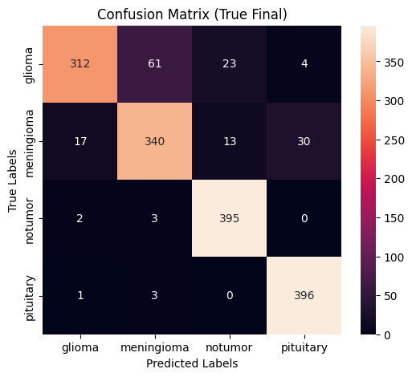
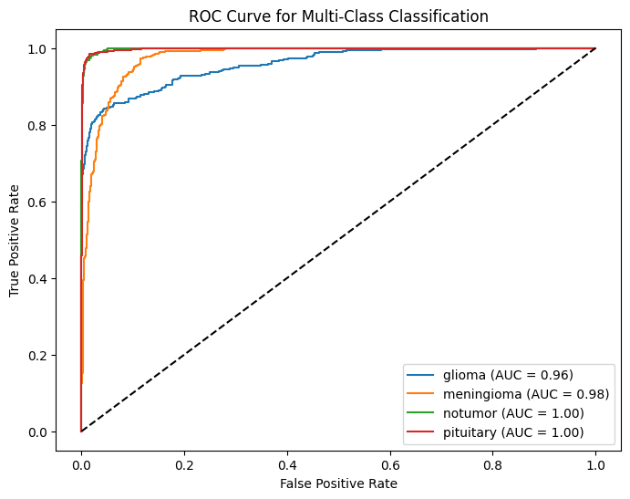
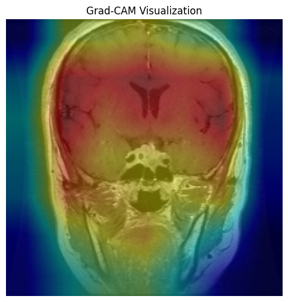

# 🧠 Brain Tumor Detection using Deep Learning

## 📌 Overview

This project presents a **Deep Learning-based system** for detecting brain tumors from MRI images using a Convolutional Neural Network (CNN).

It provides an easy-to-use **Streamlit web interface** where users can upload MRI scans and receive predictions along with visual explanations.

---

## 🚀 Features

* 🧠 MRI Image Classification (Tumor / No Tumor)
* 🤖 Pre-trained CNN Model (.h5)
* 🔍 Grad-CAM Visualization (Explainable AI)
* 🌐 Interactive Web App (Streamlit)
* 📊 Performance Evaluation (Confusion Matrix & ROC Curve)

---

## 🏗️ Project Structure

```
Brain-Tumor-Detection/
│
├── app/
│   ├── Application.py
│   ├── brain_tumor_model.h5
│
├── notebook/
│   └── Brain-Tumor-Detection-IoT.ipynb
│
├── assets/
│   ├── confusion_matrix.png
│   ├── ROC_Curve.png
│   ├── Grad-CAM.png
│
├── research/
│   └── Research Papers
│
├── requirements.txt
├── README.md
└── .gitignore
```

---

## ⚙️ Installation

### 1️⃣ Clone the Repository

```bash
git clone https://github.com/Aqib-Hanif/brain-tumor-detection-ai.git
cd brain-tumor-detection-ai
```

### 2️⃣ Install Dependencies

```bash
pip install -r requirements.txt
```

---

## ▶️ Run the Application

```bash
streamlit run app/Application.py
```

Open in browser:

```
http://localhost:8501
```

---

## 📊 Results

### Confusion Matrix



### ROC Curve



### Grad-CAM Visualization



---

## 🧪 Model Details

* Framework: TensorFlow / Keras
* Model Type: Convolutional Neural Network (CNN)
* Input: MRI Brain Images
* Output: Binary Classification (Tumor / No Tumor)

---

## 📚 Dataset

* MRI brain image dataset
* Contains tumor and non-tumor labeled images

---

## 📖 Research Papers

All supporting research papers are available in the `/research` directory.

---

## 🌍 Future Improvements

* 🔬 Improve accuracy with larger datasets
* 🧠 Multi-class tumor classification
* ☁️ Cloud deployment
* 📱 Mobile application integration

---

## 🤝 Contributing

Feel free to fork this repository and submit pull requests.

---

## 👨‍💻 Author

**Aqib Hanif**
🔗 GitHub: https://github.com/Aqib-Hanif

---

## ⭐ Support

If you like this project, consider giving it a **star ⭐ on GitHub**!

---
